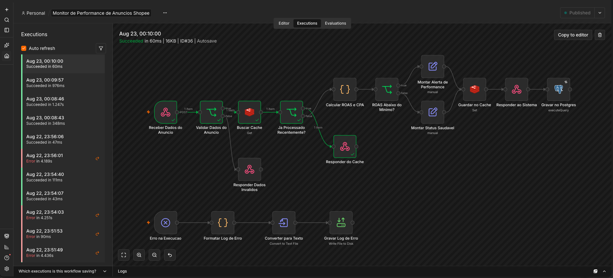
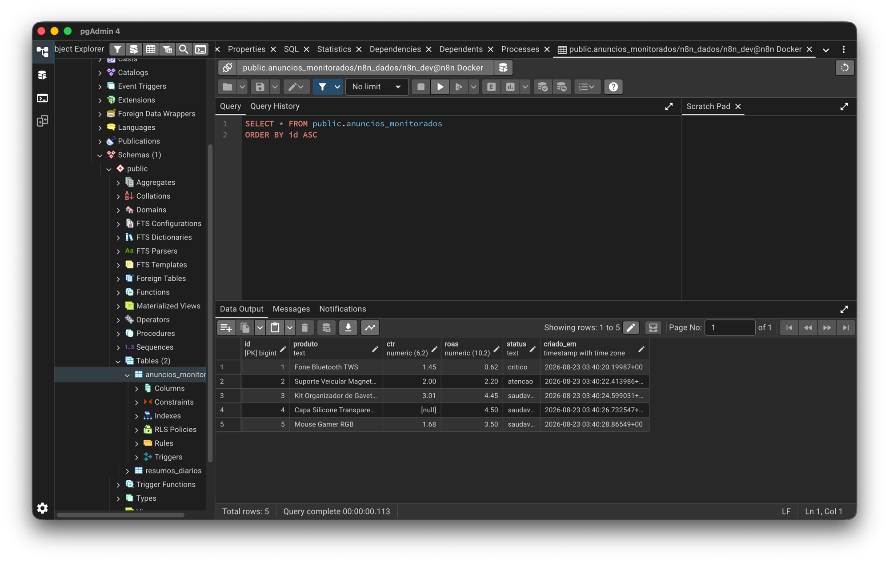

# Monitor de Performance de Anúncios — n8n

Automação que recebe as métricas de um anúncio, calcula os indicadores de
eficiência e dispara alerta quando o ROAS fica abaixo da meta. Construída em n8n,
com histórico persistido em PostgreSQL.

**Problema que resolve:** times de mídia paga perdem tempo revisando manualmente
métricas de anúncios pra identificar quais estão com performance ruim. Esse
workflow automatiza a detecção e guarda o histórico para análise posterior.

---

## Como funciona

- Recebe métricas via webhook (`anuncio`, `gasto`, `faturamento`, `vendas_qtd`, `cliques`, `impressoes`)
- Valida os campos obrigatórios antes de calcular qualquer coisa
- Calcula CTR, ROAS, CPA e ticket médio
- Sinaliza alerta quando o ROAS fica abaixo da meta (padrão 3x)
- Quando há alerta, informa **quanto falta** de faturamento e a quantas vendas isso equivale
- Retorna diagnóstico estruturado e grava a linha em `anuncios_monitorados`

## Os 9 nós do fluxo principal

> Mais 4 nós de cache (Redis) e 4 de tratamento de erro, descritos adiante — 17 no total.

```
Receber Dados do Anuncio (Webhook)
        │
Validar Dados do Anuncio (IF) ──[false]──▶ Responder Dados Invalidos      400
        │
Calcular ROAS e CPA (Code)
        │
ROAS Abaixo do Minimo? (IF)
        ├──[true]───▶ Montar Alerta de Performance (Set) ─┐
        └──[false]──▶ Montar Status Saudavel (Set) ───────┤
                                                          ▼
                                             Responder ao Sistema         200
                                                          │
                                             Gravar no Postgres
```

## Cálculos exatos

Todos no nó `Calcular ROAS e CPA`:

| Métrica | Fórmula | Observação |
|---|---|---|
| `roas` | `faturamento ÷ gasto` | 0 se não houve gasto |
| `ctr` | `(cliques ÷ impressoes) × 100` | `null` se não vierem impressões |
| `cpa` | `gasto ÷ vendas_qtd` | custo por aquisição |
| `ticket_medio` | `faturamento ÷ vendas_qtd` | |
| `resultado` | `faturamento − gasto` | negativo = prejuízo |
| `taxa_conversao` | `(vendas_qtd ÷ cliques) × 100` | `null` se não vierem cliques |
| `gap_faturamento` | `max(gasto × roas_minimo − faturamento, 0)` | quanto falta pra meta |
| `vendas_faltantes` | `ceil(gap_faturamento ÷ ticket_medio)` | traduz o gap em vendas |
| `classificacao` | `saudavel` ≥ meta · `atencao` ≥ 1x · `critico` < 1x | |

## Decisões técnicas

- **Nó Code em vez de expressões inline.** São nove métricas com divisões que
  precisam de guarda contra zero. Espalhar isso em expressões dentro de nós Set
  deixaria a lógica ilegível e sem lugar para comentar o porquê.

- **Meta de ROAS configurável, não hardcoded.** Vem em `roas_minimo` no payload e
  cai em `3` como padrão. Cada categoria de produto tem margem diferente — fixar
  no código obrigaria a duplicar o workflow por categoria.

- **Classificação em três níveis, alerta binário.** `critico` (ROAS < 1x, o
  anúncio dá prejuízo direto) é diferente de `atencao` (ROAS entre 1x e a meta,
  paga o custo mas não entrega margem). Os dois disparam alerta, mas o banco
  guarda a distinção para análise depois.

- **CTR vira `null`, não zero, quando faltam impressões.** Zero afirmaria que
  ninguém clicou; `null` diz que não dá pra saber. A coluna é nullable de
  propósito, e uma média futura não fica contaminada por zeros falsos.

- **Os dois ramos convergem num único nó de resposta**, que devolve o objeto
  inteiro com um campo booleano `alerta`. Quem consome o webhook decide o que
  fazer sem precisar interpretar texto.

- **O nó Postgres vem depois do `Respond to Webhook`.** O nó Postgres substitui o
  `$json` da saída — se viesse antes, a resposta HTTP sairia com `{id, criado_em}`
  em vez do diagnóstico. `Respond to Webhook` envia a resposta mas não encerra a
  execução, então a gravação acontece logo em seguida. O custo: se o INSERT
  falhar, quem chamou já recebeu 200 — a falha fica visível na lista de execuções
  do n8n, não para o cliente.

- **Parâmetros SQL posicionais (`$1, $2, $3, $4`), não concatenação.** O driver
  envia comando e valores separados, o que elimina SQL injection — mesmo
  princípio do `PreparedStatement`. E são passados como **array**, não como lista
  separada por vírgula: a lista quebraria se um nome de produto contivesse vírgula.

---

## Exemplo

**Requisição**

```http
POST http://localhost:5678/webhook/monitor-anuncio
Content-Type: application/json

{
  "anuncio": "Fone Bluetooth TWS",
  "gasto": 1240.00,
  "faturamento": 768.50,
  "vendas_qtd": 9,
  "cliques": 413,
  "impressoes": 28400
}
```

`anuncio`, `cliques`, `impressoes` e `roas_minimo` são opcionais. Os obrigatórios
são `gasto`, `faturamento` e `vendas_qtd`.

**Resposta — ROAS abaixo da meta**

```
🔴 ALERTA — PERFORMANCE ABAIXO DO MÍNIMO
Fone Bluetooth TWS · 22/08/2026 21:09

INVESTIMENTO x RETORNO
Gasto .......... R$ 1.240,00
Faturamento .... R$ 768,50
Resultado ...... -R$ 471,50
ROAS ........... 0.62x  (mínimo: 3x)

OPERAÇÃO
Vendas ......... 9
CPA ............ R$ 137,78
Ticket médio ... R$ 85,39

Faltam R$ 2.951,50 de faturamento para atingir o ROAS mínimo — cerca de 35 vendas no ticket atual.
Ação sugerida: revisar segmentação e criativo, ou pausar o anúncio.
```

**Resposta — ROAS saudável**

```
🟢 ANÚNCIO DENTRO DA META
Kit Organizador de Gavetas · 22/08/2026 21:09

INVESTIMENTO x RETORNO
Gasto .......... R$ 480,00
Faturamento .... R$ 2.136,90
Resultado ...... R$ 1.656,90
ROAS ........... 4.45x  (mínimo: 3x)

OPERAÇÃO
Vendas ......... 31
CPA ............ R$ 15,48
Ticket médio ... R$ 68,93

Nenhuma ação necessária.
```



---

## Persistência

O resultado de cada monitoramento vira uma linha em `anuncios_monitorados`
(schema em [`sql/schema.sql`](sql/schema.sql)).

**Decisão:** valores monetários e percentuais em `NUMERIC`, nunca em ponto
flutuante. Binário não representa `0,10` exatamente e o erro acumula a cada
operação — o mesmo motivo pelo qual se usa `BigDecimal` em vez de `double` no Java.

Estado após a bateria de testes:

```
 id |          produto           | ctr  | roas |  status
----+----------------------------+------+------+----------
  1 | Fone Bluetooth TWS         | 1.45 | 0.62 | critico
  2 | Suporte Veicular Magnetico | 2.00 | 2.20 | atencao
  3 | Kit Organizador de Gavetas | 3.01 | 4.45 | saudavel
```



---

## Cache e idempotência (Redis)

Antes de calcular qualquer coisa, o workflow verifica se aquele anúncio já foi
processado nos últimos 5 minutos. Se já foi, devolve o resultado guardado e não
recalcula nem grava de novo no banco.

```
Validar Dados do Anuncio
   → Buscar Cache (Redis get → anuncio:<nome>)
        → Ja Processado Recentemente? (IF)
             [true]  → Responder do Cache (200, com origem: "cache")
             [false] → Calcular ROAS e CPA → ... → Guardar no Cache (set, TTL 300s)
```

**Medido com a mesma requisição duas vezes seguidas:**

| | 1ª chamada | 2ª chamada |
|---|---|---|
| Tempo de resposta | 838ms | **100ms** |
| Campo `origem` | ausente (calculado) | `cache` |
| Gravou no Postgres | sim | **não** |

**Decisões técnicas:**

- **A expiração é responsabilidade do Redis, não do workflow.** `expire: true`
  com `ttl: 300` faz a chave sumir sozinha. Guardar isso no Postgres exigiria uma
  coluna de validade e uma rotina de limpeza — duas coisas a mais para manter.

- **O cache resolve a idempotência de tabela.** Sem ele, a mesma requisição
  enviada duas vezes gerava duas linhas em `anuncios_monitorados`, poluindo
  qualquer média histórica. A janela de 5 minutos é curta o bastante para não
  esconder mudança real de performance, e longa o bastante para absorver reenvio.

- **A resposta vinda do cache é marcada com `origem: "cache"`.** Quem consome
  precisa saber se está lendo um número recalculado agora ou um de até 5 minutos
  atrás. Devolver os dois indistinguíveis seria esconder informação relevante.

- **O nó Code lê o payload pelo nome do nó de origem**, não pelo item que chega:

  ```js
  const d = $('Receber Dados do Anuncio').first().json.body ?? $input.first().json;
  ```

  Isso é obrigatório aqui. O nó Redis na operação `get` **descarta o item de
  entrada** e devolve apenas `{ cache: ... }` — internamente ele cria um item
  vazio (`item = { json: {} }`) em vez de acrescentar o campo ao existente. As
  operações `set`, `push` e `delete` preservam a entrada; a `get` não. Sem essa
  correção, todo o payload se perdia entre o cache e o cálculo.


---

## Tratamento de erro

Erro esperado (payload inválido) já é tratado pelo fluxo principal, com os status
HTTP acima. Esta seção é sobre a outra categoria: **o nó quebrou** — banco fora do
ar, timeout, credencial expirada.

Duas camadas:

**1. Retry por nó.** O nó `Gravar no Postgres` está com `retryOnFail`, 3 tentativas
e 2 segundos de espera entre elas. Cobre a falha transitória — o banco engasgou por
um instante e a segunda tentativa funciona.

**2. Error Trigger.** Um ramo independente, que o n8n aciona sozinho quando a
execução falha:

```
Erro na Execucao (Error Trigger)
   → Formatar Log de Erro (Code)
   → Converter para Texto (Convert to File)
   → Gravar Log de Erro (Read/Write Files, com append)
```

O log vai para `~/.n8n-files/erros-n8n.log`, uma linha por falha:

```
2026-08-22 23:56:06 | workflow=Monitor de Performance de Anuncios Shopee | execucao=31 | modo=webhook | no=Gravar no Postgres | erro=Connection refused
```

**Decisões técnicas:**

- **O log vai para arquivo, não para o Postgres.** Se o handler gravasse no banco,
  ele quebraria junto com o que estava tentando registrar — o log sumiria exatamente
  quando é mais necessário. Quem registra a falha não pode depender da peça que falhou.

- **O caminho do log é `~/.n8n-files/`, não uma pasta qualquer.** O n8n restringe
  escrita em disco: `restrictFileAccessTo` vem com `~/.n8n-files` como padrão, e
  qualquer outro caminho falha com "Access to the file is not allowed". A opção foi
  respeitar a restrição em vez de afrouxar a configuração da instância.

- **`timezone: America/Sao_Paulo` explícito nas configurações do workflow.** O padrão
  do n8n é `America/New_York`. Sem essa definição, o `$now` dos nós Code grava uma
  hora a menos — o que aparecia nos carimbos do log.

**Testado derrubando o ambiente:** com o container do Postgres parado, uma requisição
de produção respondeu `200` em 0,2s (a resposta vem antes da gravação), o nó tentou
gravar 3 vezes em ~5 segundos, desistiu com `Connection refused`, e o Error Trigger
registrou a falha no log. Com o banco de volta, a mesma requisição gravou normalmente.

**Limite conhecido:** a requisição que chega enquanto o banco está fora se perde — ela
recebeu `200` e nunca foi persistida. Retry cobre falha de segundos, não de minutos.
Resolver isso exigiria fila com dead-letter, fora do escopo deste projeto.

---

## Stack

| Camada | Tecnologia |
|---|---|
| Orquestração | n8n 2.35.7 |
| Gatilho | Webhook (POST, modo `responseNode`) |
| Lógica | Nó Code (JavaScript) · nó IF com operadores de número |
| Cache | Redis 7 em Docker, chave com TTL de 300s |
| Persistência | PostgreSQL 17 em Docker, SQL parametrizado |
| Tratamento de erro | `retryOnFail` por nó · Error Trigger gravando log em disco |
| Testes | Coleção Postman com asserções automáticas |

---

## Como rodar localmente

**1. Subir o banco**

```bash
docker run -d --name n8n-postgres \
  -e POSTGRES_USER=n8n_dev \
  -e POSTGRES_PASSWORD=dev_local_123 \
  -e POSTGRES_DB=n8n_dados \
  -p 5433:5432 \
  -v n8n_pgdata:/var/lib/postgresql/data \
  postgres:17-alpine

docker exec -i n8n-postgres psql -U n8n_dev -d n8n_dados < sql/schema.sql
```

Credenciais descartáveis, de desenvolvimento local. A porta do host é **5433**
porque a 5432 já estava ocupada por outra instalação do PostgreSQL na máquina —
dentro do container o serviço continua na 5432.

**2. Importar o workflow**

No n8n: **Workflows → ⋯ → Import from File** → `workflow/monitor-performance-anuncios.json`

**3. Criar a credencial**

**Settings → Credentials → New → Postgres**, apontando para `localhost:5433`,
banco `n8n_dados`, usuário `n8n_dev`. Depois, associar ao nó `Gravar no Postgres`.

**4. Ativar e testar**

O workflow precisa estar **ativo** — webhook de produção não responde com o
workflow desligado.

Importe [`postman/monitor-anuncios.postman_collection.json`](postman/) no Postman.
São 4 requisições com asserções automáticas: ROAS baixo, ROAS saudável, payload
inválido e um caso sem impressões que demonstra o CTR virando `null`.

---

## Testes

| Cenário | Esperado | Resultado |
|---|---|---|
| ROAS 0.62x (abaixo de 1x) | `200`, `alerta: true`, `critico` | ✅ |
| ROAS 2.20x (entre 1x e a meta) | `200`, `alerta: true`, `atencao` | ✅ |
| ROAS 4.45x (acima da meta) | `200`, `alerta: false`, `saudavel` | ✅ |
| Sem `faturamento` | `400`, `status: invalido` | ✅ |
| Sem `impressoes` | `200`, `ctr: null` | ✅ |

Todos os ramos condicionais foram percorridos e conferidos nó a nó pelo histórico
de execuções do n8n.
